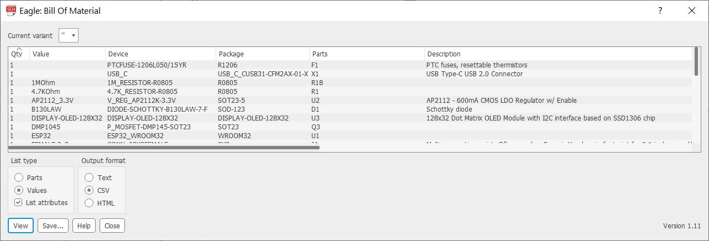
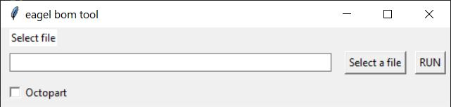

# Eagle BOM Converter
a simple script to convert eagle BOM.ulp script csv output file in to excel format and add distributor price using Octopart excel add-in

## Features
- convert a CSV BOM (exported fro eagle) to excel.
- Removes unnecessary attributes.
- Adding an index column. 
- Removes rows with EXCLUDE attribute from BOM.
- Generate a excel BOM with Octopart formulas and price estimate. 

## Dependencies
* Python3
* openpyxl   
Install using pip
```shell
pip install openpyxl
```

### Octopart add-in 
https://octopart.com/excel

## Usage

1. add Part Attributes in eagle library:
This script is searching for specific attributes in the csv file:   
    - Parts = part designator.     
    - Qty = part quantity.  
    - MF  = part manufacturer.   
    - MPN = manufacturer part number. 
    - VALUE =  i use it for capcitors and resistors values.
    - FOOTPRINT =  part package.
    - DESCRIPTION = i use the Description from Digi-key.

You can add those attributes to your parts or change the line of code that contains the attributes:
```python
newDf = bomDf[['Qty', 'Parts','MF','MPN','VALUE','FOOTPRINT','DESCRIPTION']].copy()
```
2. Export CSV BOM from Eagle:  
To generate a BOM file from Eagle make sure you are in the Schematic Editor and go to **File > Export > BOM.** This will open up a new window where you can configure how you want the BOM file to look like. Check Values and CSV optionNext you can save the bom.csv file to the desired location by clicking the Save button.



3. Run the python script from command line:
```shell
repo path/python bomToolGuiV3.py  
```


## TO DO
- [ ] Improve column with auto size fit.
- [ ] easy attribute customization.